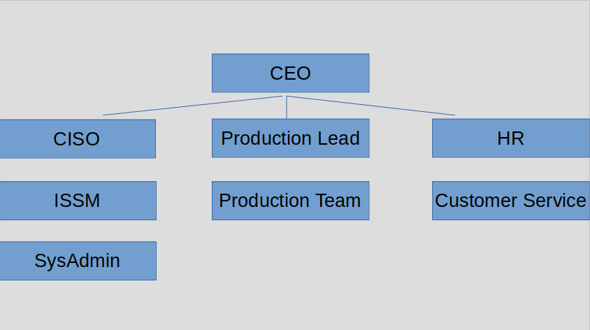

# Tasks and Outcomes

| Task | Title | Outcome |
|----- |------ |-------- |
| P-1 | Risk Management Roles | Individuals are identified and assigned key roles for executing the Risk Management Framework. |
| P-2 | Risk Management Strategy | A risk management strategy for the organization that includes a determination and expression of organizational risk tolerance is established |
| P-3 | Risk Assessment - Organization | An organization-wide risk assessment is completed or an existing risk assessment is updated. |
| P-4 | Organizationally-Tailored Control Baselines and Cybersecurity Framework Profiles (optional) | Organizationally-tailored control baselines and/or Cybersecurity Framework Profiles are established and made available. |
| P-5 | Common Control Identification | Common controls that are available for inheritance by organizational systems are identified, documented, and published. |
| P-6 | Impact-Level Prioritization (optional) | A prioritization of organizational systems with the same impact level is conducted. |
| P-7 | Continuous Monitoring Strategy - Orgnanization | An organization-wide strategy for monitoring control effectiveness is developed and implemented. |

**Table 1** - Tasks and outcomes of the Prepare step.

# P1 - Risk Management Roles

## Outcome
Individuals are identified and assigned key roles for executing the Risk Management Framework.

## Input: 

**Reference 1** - Organizational hierarchy of example company.
Output: Documented Risk Management Framework role assignments (reference SP 800-37, appendix D, for roles and responsibilities).

**Example output:**
| Role | Assignee | Roles and Responsibilities |
|----- |--------- |------------ |
| Authorizing Official | CEO | Senior official with authority to assume responsibility for the system; accepts risk of system to organization. |
| Chief Information Officer | CISO | Oversees security policies, procedures, and controls addressing security. |
| Information Owner | CEO | Official with statutory, management, or operational authority for specified information and responsibility for establishing policies and procedures for its generation, collection, processing, dissemination, and disposal. |
| Mission or Business Owner | CEO | Senior official with specific mission with security or privacy interest in the organizational systems supporting those missions. Key stakeholders with significant roles in establishing protection. |
| System Administrator | SysAdmin | Setup and maintain system. Install and configure hardware and software. Conducts backups, recovery. Etc. |
| System Owner | CISO | Responsible for procurement, development, and operation of a system. Develops and maintains security and privacy plans. Decides who has access to system and their privileges. Assembles authorization package and submits to authorizing official for adjudication. |
| System Security/Privacy Officer | ISSM | Ensures security and privacy posture is maintained for the system and works closely with the system owner. Serves as the principal advisor on all matters involving controls for the system. Knowledge and expertise to manage the security and privacy aspects of the system and day-to-day security and privacy operations. May include physical, environmental, and personnel security; incident handling; and user training. |
| System User | All employees | Authorized access to information system and its information in order to perform assigned duties. |

NOTE: Responsibilities lie with assigned individuals, however many tasks are delgated down (e.g. the CISO is responsible for secure procurement of hardware, however the SysAdmin is delegated the task of ordering and receiving hardware, with the CISO's oversight with policies and standard operating procedures (SOP's)).

---

# P2 - Risk Management Strategy

## Outcome
A risk management strategy for the organization that includes a determination and expression of organizational risk tolerance is established